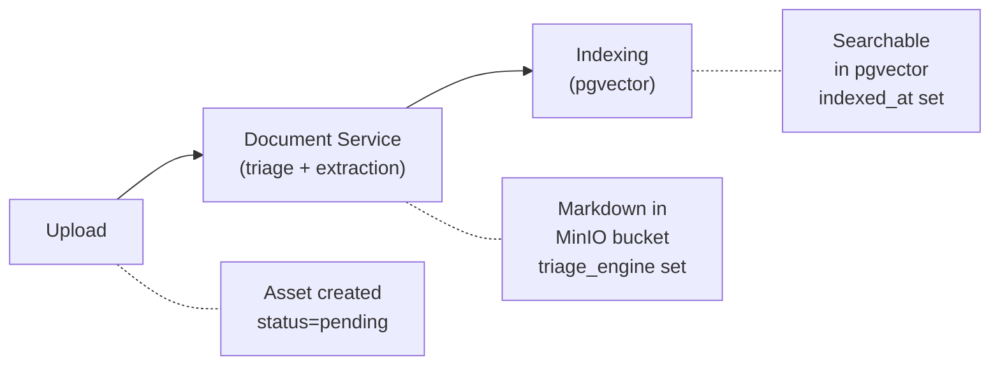

# Document Processing Pipeline

This document describes how Curatore processes documents from upload through search indexing using the standalone **Document Service**.

## Overview

Curatore delegates all document extraction to an external **Document Service** (running at port 8010). The Document Service handles triage (engine selection), extraction, and returns Markdown content. The backend acts as a thin orchestrator — it uploads files, stores results, and triggers search indexing.



## Architecture

### Backend (curatore-backend)

The backend is a thin orchestrator:

1. **`DocumentServiceAdapter`** (`connectors/adapters/document_service_adapter.py`) — HTTP client that POSTs files to the Document Service via `POST /api/v1/extract`. Follows the `ServiceAdapter` ABC pattern with 3-tier config resolution (DB Connection → config.yml → ENV vars).

2. **`ExtractionOrchestrator`** (`core/ingestion/extraction_orchestrator.py`) — Coordinates extraction runs: downloads file from MinIO, sends to Document Service via adapter, stores result in MinIO and database.

3. **`DocumentService`** (`core/shared/document_service.py`) — Higher-level document operations (content extraction, health checks, format support). Delegates to the adapter.

### Document Service (standalone)

The Document Service (`curatore-document-service` repo, port 8010) handles all extraction internally:

- **Triage**: Analyzes documents to select the optimal engine
- **Engines**: `fast_pdf` (PyMuPDF), `markitdown` (MarkItDown + LibreOffice), `pymupdf4llm` (PyMuPDF4LLM + Tesseract OCR)
- **API**: `POST /api/v1/extract`, `GET /api/v1/system/health`, `GET /api/v1/system/capabilities`, `GET /api/v1/system/supported-formats`

The Document Service uses pymupdf4llm (a local Python library with Tesseract OCR) for complex extraction. No external HTTP service is required. The backend never communicates with extraction engines directly.

## Extraction Flow

### 1. Upload / Ingestion

Documents enter Curatore through multiple sources:

| Source | Endpoint/Trigger | Source Type |
|--------|------------------|-------------|
| Manual Upload | `POST /api/v1/storage/upload/proxy` | `upload` |
| SharePoint Sync | SharePoint sync job | `sharepoint` |
| Web Scraping | Scrape collection crawl | `web_scrape` |
| SAM.gov | SAM pull job | `sam_gov` |

**What Happens**:
1. File uploaded to MinIO (`curatore-original` bucket)
2. `Asset` record created with `status=pending`
3. `Run` record created with `run_type=extraction`
4. `ExtractionQueueService` routes task to the appropriate Celery queue:
   - **`extraction` queue** (worker-fast): Text files, small PDFs (<=1MB), small Office docs (<=5MB)
   - **`extraction_heavy` queue** (worker-heavy): Large PDFs (>1MB), large Office files (>5MB) — likely to need pymupdf4llm

### 2. Extraction (via Document Service)

The `ExtractionOrchestrator` sends the file to the Document Service:

1. Download file from MinIO to temp path
2. `POST /api/v1/extract` with multipart file upload to Document Service
3. Document Service performs triage internally (engine selection)
4. Document Service extracts content and returns JSON with:
   - `content_markdown` — extracted text in Markdown
   - `method` — engine used (`fast_pdf`, `markitdown`, `pymupdf4llm`)
   - `triage` block — triage metadata (engine, needs_ocr, complexity, duration_ms)
5. Backend uploads Markdown to `curatore-processed` bucket
6. Backend updates `ExtractionResult` with triage fields

### 3. Search Indexing

After extraction completes:

1. Download extracted Markdown
2. Split into chunks (~1500 chars with 200 char overlap)
3. Generate embeddings via OpenAI API (text-embedding-3-small)
4. Insert into `search_chunks` table (PostgreSQL + pgvector)
5. Set `indexed_at` timestamp on Asset

## Extraction Engines (inside Document Service)

The Document Service uses three extraction engines internally:

### 1. fast_pdf (PyMuPDF)
- Fast local extraction for simple, text-based PDFs
- Used when PDF has extractable text layer, simple layout

### 2. markitdown (MarkItDown)
- Document conversion for Office files, text files, and emails
- Supports: `.docx`, `.doc`, `.pptx`, `.ppt`, `.xlsx`, `.xls`, `.xlsb`, `.txt`, `.md`, `.csv`, `.msg`, `.eml`, `.html`, `.htm`, `.xml`, `.json`

### 3. pymupdf4llm (PyMuPDF4LLM)
- Advanced extraction for complex documents requiring OCR or layout analysis
- Used for scanned PDFs, complex layouts, large Office files
- Local Python library with Tesseract OCR support; ARM-native, no external HTTP service required

## Extraction Result Fields

After extraction, the `ExtractionResult` record stores triage decisions:

```python
ExtractionResult {
    # Core fields
    status: "completed"

    # Triage fields (from Document Service response)
    triage_engine: "fast_pdf" | "markitdown" | "pymupdf4llm"
    triage_needs_ocr: bool
    triage_needs_layout: bool
    triage_complexity: "low" | "medium" | "high"
    triage_duration_ms: int

    # Structure metadata (document profile, components, quality signals)
    structure_metadata: {...}  # from Document Service response
}
```

The `triage_engine` value is also written as `extraction_method` into `source_metadata.file` for search indexing and faceted filtering.

## Configuration

### Document Service Connection

The backend connects to the Document Service via the `DocumentServiceAdapter`. Configuration follows the 3-tier resolution pattern:

1. **DB Connection** (per-org): Connection record with `connection_type=extraction`
2. **config.yml**: `extraction` section (flat, service-discovery-only)
3. **Environment variables**: `DOCUMENT_SERVICE_URL`, `DOCUMENT_SERVICE_API_KEY`, `DOCUMENT_SERVICE_TIMEOUT`, `DOCUMENT_SERVICE_VERIFY_SSL`

### config.yml Example

```yaml
extraction:
  enabled: true
  service_url: http://document-service:8010
  api_key: ${DOCUMENT_SERVICE_API_KEY}
  timeout: 240
  verify_ssl: true
```

### docker-compose.yml

The backend connects to the Document Service container via `curatore-network`:

```yaml
environment:
  - DOCUMENT_SERVICE_URL=http://document-service:8010
```

### Enable/Disable Search Indexing

```yaml
search:
  enabled: true  # Set to false to disable indexing
```

## Monitoring

### Health Check

```bash
# Comprehensive health (includes Document Service)
curl http://localhost:8000/api/v1/admin/system/health/comprehensive

# Document Service direct
curl http://localhost:8010/api/v1/system/health

# Document Service capabilities (shows pymupdf4llm availability)
curl http://localhost:8010/api/v1/system/capabilities
```

### API Response

`GET /api/v1/assets/{id}` returns:
```json
{
  "asset": {
    "id": "...",
    "status": "ready",
    "indexed_at": "2026-02-01T19:05:00Z"
  },
  "extraction": {
    "status": "completed",
    "triage_engine": "pymupdf4llm",
    "triage_needs_ocr": true,
    "triage_needs_layout": true,
    "triage_complexity": "high",
    "triage_duration_ms": 45,
    "structure_metadata": {
      "document_profile": {"content_type": "text", "total_chars": 12500, "total_words": 2100},
      "components": {"headings_h1": 3, "tables": 2, "images": 1},
      "quality_signals": {"extraction_coverage": 0.98, "pages_ocr_applied": 2}
    }
  }
}
```

### SQL Queries

```sql
-- Assets by extraction engine
SELECT triage_engine, COUNT(*)
FROM extraction_results
WHERE status = 'completed'
GROUP BY triage_engine;

-- Average triage duration by engine
SELECT triage_engine, AVG(triage_duration_ms) as avg_ms
FROM extraction_results
WHERE triage_duration_ms IS NOT NULL
GROUP BY triage_engine;

-- Documents that needed OCR
SELECT a.original_filename, er.triage_engine, er.triage_complexity
FROM extraction_results er
JOIN assets a ON er.asset_id = a.id
WHERE er.triage_needs_ocr = true;
```

## Re-processing

### Trigger Re-extraction

```bash
curl -X POST http://localhost:8000/api/v1/assets/{id}/reextract
```

This creates a new extraction Run and sends the file to the Document Service again.

### Bulk Re-extraction

```bash
docker exec curatore-backend python -m app.commands.reextract_all
```

Options:
- `--dry-run`: Show what would be done
- `--limit N`: Process only N assets
- `--batch-size N`: Process in batches of N

### Trigger Search Reindex

```bash
curl -X POST http://localhost:8000/api/v1/search/reindex
```

## Related Documentation

| Document | Description |
|----------|-------------|
| [Extraction Engines](EXTRACTION_SERVICES.md) | Triage, engine comparison, supported formats |
| [Configuration](CONFIGURATION.md) | config.yml settings |
| [Search & Indexing](https://github.com/Amivero-LLC/curatore-backend/blob/main/docs/SEARCH_INDEXING.md) | Hybrid search, chunking, embeddings |
| [Queue System](https://github.com/Amivero-LLC/curatore-backend/blob/main/docs/QUEUE_SYSTEM.md) | Celery queue architecture |
