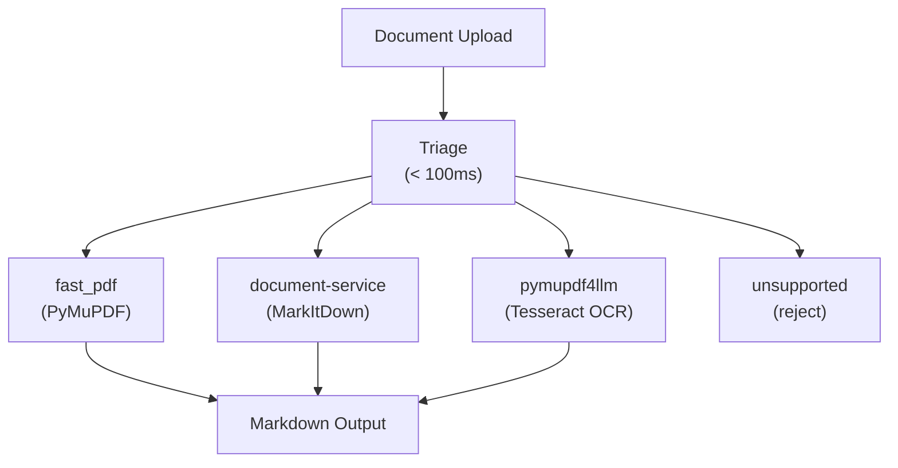

# Extraction Services Reference

Curatore v2 uses a **triage-based extraction architecture** that analyzes each document before extraction and routes it to the optimal extraction engine.

For detailed pipeline documentation, see [DOCUMENT_PROCESSING.md](DOCUMENT_PROCESSING.md).

## Architecture Overview



## Quick Comparison

| Feature | fast_pdf | document-service | pymupdf4llm |
|---------|----------|-----------------|-------------|
| **Location** | Local (worker) | Container (8010) | Local (worker) |
| **Technology** | PyMuPDF | MarkItDown + LibreOffice | pymupdf4llm + Tesseract OCR |
| **PDF (simple)** | Yes (fast) | No | Yes |
| **PDF (scanned)** | No | No | Yes (OCR via Tesseract) |
| **Office files** | No | Yes | No |
| **Text/HTML/Email** | No | Yes | No |
| **Table Extraction** | Basic | Basic | Advanced |
| **Speed** | Very Fast | Fast | Moderate |
| **Resource Usage** | Low | Low | Low-Moderate |

## Extraction Engines

### 1. fast_pdf (PyMuPDF)

**Purpose:** Fast local extraction for simple, text-based PDFs.

**Technology:** PyMuPDF (fitz) - runs locally in the Celery worker, no external service call required.

**Supported Extensions:** `.pdf`

**When Used by Triage:**
- PDF has extractable text layer (not scanned)
- Simple layout (< 50 blocks/page)
- Few images (< 3 images/page)
- No complex tables

**Characteristics:**
- Very fast (sub-second for most documents)
- No network latency
- Low resource usage
- Best for reports, articles, simple documents

### 2. document-service (MarkItDown)

**Purpose:** Document conversion for Office files, text files, and emails.

**Technology:** MarkItDown + LibreOffice (for legacy format conversion)

**Port:** 8010

**Supported Extensions:**
| Extension | MIME Type | Notes |
|-----------|-----------|-------|
| `.docx` | application/vnd.openxmlformats-officedocument.wordprocessingml.document | Word documents |
| `.doc` | application/msword | Legacy Word (via LibreOffice) |
| `.pptx` | application/vnd.openxmlformats-officedocument.presentationml.presentation | PowerPoint |
| `.ppt` | application/vnd.ms-powerpoint | Legacy PowerPoint (via LibreOffice) |
| `.xlsx` | application/vnd.openxmlformats-officedocument.spreadsheetml.sheet | Excel |
| `.xls` | application/vnd.ms-excel | Legacy Excel (via LibreOffice) |
| `.xlsb` | application/vnd.ms-excel.sheet.binary.macroEnabled.12 | Excel Binary (via LibreOffice) |
| `.txt` | text/plain | Plain text |
| `.md` | text/markdown | Markdown |
| `.csv` | text/csv | CSV files |
| `.html`, `.htm` | text/html | HTML files |
| `.xml` | text/xml | XML files |
| `.json` | application/json | JSON files |
| `.msg` | application/vnd.ms-outlook | Outlook emails |
| `.eml` | message/rfc822 | Email files |

**When Used by Triage:**
- All Office documents (< 5MB)
- All text-based files
- All email files
- Unknown file types (fallback)

**API Example:**
```bash
curl -X POST "http://localhost:8010/api/v1/extract" \
  -F "file=@document.docx"
```

**Response:**
```json
{
  "filename": "document.docx",
  "content_markdown": "# Document Content...",
  "content_chars": 1234,
  "method": "markitdown",
  "ocr_used": false,
  "page_count": 5,
  "media_type": "application/vnd.openxmlformats-officedocument.wordprocessingml.document"
}
```

### 3. pymupdf4llm

**Purpose:** Advanced PDF extraction for complex documents requiring OCR or layout analysis.

**Technology:** pymupdf4llm (local Python library) with Tesseract OCR. Runs directly in the Celery worker -- no external service needed.

**Supported Extensions:**
| Extension | Use Case |
|-----------|----------|
| `.pdf` | Scanned PDFs, complex layouts, tables |

**When Used by Triage:**
- Scanned PDFs (little/no text layer)
- Complex PDF layouts (many blocks, images, tables)
- Documents requiring OCR

**Characteristics:**
- High quality extraction with LLM-optimized markdown output
- Advanced table recognition
- OCR for scanned content via Tesseract
- ARM-native, no external service dependency
- Runs locally in the worker process (no network latency)

## Pre-Flight Validation

Before extraction begins, two layers of validation reject files that cannot or should not be processed. Both checks run before any download or engine work, so rejected files fail fast.

### File Size Limit

| Layer | Check | Default Limit | Config |
|-------|-------|---------------|--------|
| **Backend** (`extraction_orchestrator.py`) | `asset.file_size` from DB | 50 MB | `settings.max_file_size` |
| **Document Service** (`extract.py`) | `os.path.getsize()` after disk save | 50 MB | `settings.MAX_FILE_SIZE` / `MAX_FILE_SIZE` env var |

The backend check runs first — oversized files are never downloaded from MinIO. The document service check is defense-in-depth for direct API callers. Both return `failure_category: "file_too_large"` which routes the asset to `unsupported` status (non-retryable).

### Password-Protected Files

The document service detects encrypted Office files by checking for OLE2 magic bytes (`D0 CF 11 E0 A1 B1 1A E1`). Modern Office formats (`.xlsx`, `.docx`, `.pptx`) are normally ZIP-based; if they have OLE2 magic, they are encrypted. Returns HTTP 422 with `reason: "password_protected"`, which the backend classifies as `failure_category: "password_protected"` and routes to `unsupported` status.

### Unsupported File Types

The backend validates file extensions against the `SUPPORTED_EXTENSIONS` set before downloading. The document service's triage service also rejects unknown formats. Both route to `unsupported` status.

## Unsupported File Types

The following file types are **not supported** for extraction:

| Type | Extensions | Reason |
|------|------------|--------|
| Images | `.png`, `.jpg`, `.jpeg`, `.gif`, `.bmp`, `.tiff`, `.tif`, `.webp`, `.heic` | Standalone image files are not processed. Image OCR is only performed within documents (e.g., scanned PDFs) via the pymupdf4llm engine with Tesseract. |

## Triage Decision Logic

The triage service (in the [Document Service](https://github.com/Amivero-LLC/curatore-document-service) at `app/services/triage_service.py`) runs analysis in < 100ms:

### PDF Analysis (using PyMuPDF)

Analyzes first 3 pages for:
| Check | Threshold | Result |
|-------|-----------|--------|
| Text per page | < 100 chars | Needs OCR -> `pymupdf4llm` |
| Blocks per page | > 50 | Complex layout -> `pymupdf4llm` |
| Images per page | > 3 | Image-heavy -> `pymupdf4llm` |
| Tables detected | > 20 drawing lines | Has tables -> `pymupdf4llm` |
| None of above | - | Simple text -> `fast_pdf` |

### Office File Analysis

Uses file size as a complexity proxy:
| File Size | Engine | Reason |
|-----------|--------|--------|
| < 5 MB | `document-service` | Simple document, MarkItDown handles well |
| >= 5 MB | `document-service` | Large file, MarkItDown with LibreOffice conversion |

## Configuration

### config.yml

The backend's extraction config is service-discovery-only. Engine triage and OCR settings are managed by the Document Service internally.

```yaml
extraction:
  enabled: true
  service_url: http://document-service:8010
  api_key: ${DOCUMENT_SERVICE_API_KEY}
  timeout: 240
  verify_ssl: true
```

The pymupdf4llm engine runs locally in the worker process and requires no additional service configuration. Tesseract must be installed in the worker container image.

### Concurrency & Resource Limits

Concurrency is managed at the **Celery worker pool** level in the backend.

#### Worker Pool Routing (Backend)

The backend routes extraction tasks to separate Celery queues consumed by dedicated worker pools. This prevents slow pymupdf4llm extractions from blocking fast ones:

| Worker Pool | Celery Queue | Concurrency Env Var | Default | Handles |
|-------------|-------------|---------------------|---------|---------|
| **worker-fast** | `extraction` | `CELERY_CONCURRENCY_FAST` | 6 | Text files, small PDFs, small Office docs |
| **worker-heavy** | `extraction_heavy` | `CELERY_CONCURRENCY_HEAVY` | 2 | Large/complex PDFs (>1MB, pymupdf4llm), large Office files (>5MB) |

Routing is a pre-submission heuristic based on file extension and size — see [Queue System: Extraction Queue Routing](https://github.com/Amivero-LLC/curatore-backend/blob/main/docs/QUEUE_SYSTEM.md) for the full routing table.

## Health Checks

```bash
# Extraction Service
curl http://localhost:8010/api/v1/system/health
# {"status":"ok","service":"document-service"}

# Check fast_pdf availability (PyMuPDF in worker-fast)
docker exec curatore-worker-fast python -c "import fitz; print(f'PyMuPDF {fitz.version}')"

# Check pymupdf4llm availability
docker exec curatore-worker-heavy python -c "import pymupdf4llm; print('pymupdf4llm available')"

# Check Tesseract availability (required for OCR)
docker exec curatore-worker-heavy tesseract --version
```

## Troubleshooting

### PyMuPDF not available

**Error:** `PyMuPDF not available, using fallback routing`

**Cause:** PyMuPDF not installed in worker container

**Solution:**
```bash
docker-compose build --no-cache worker
docker-compose up -d worker
```

### pymupdf4llm Import Error

**Error:** `ModuleNotFoundError: No module named 'pymupdf4llm'`

**Cause:** pymupdf4llm not installed in worker container

**Solution:**
```bash
docker-compose build --no-cache worker
docker-compose up -d worker
```

### Tesseract Not Found

**Error:** `TesseractNotFoundError: tesseract is not installed`

**Cause:** Tesseract OCR not installed in worker container image

**Solution:** Ensure the worker Dockerfile includes `apt-get install -y tesseract-ocr`

### Images Not Processing

**Error:** `Unsupported file type`

**Cause:** Standalone images are not supported

**Solution:** Image OCR is only available within documents (PDFs). Convert images to PDF first if OCR is needed.

## References

- [pymupdf4llm](https://pymupdf.readthedocs.io/en/latest/pymupdf4llm/)
- [MarkItDown](https://github.com/microsoft/markitdown)
- [PyMuPDF](https://pymupdf.readthedocs.io/)
- [Tesseract OCR](https://github.com/tesseract-ocr/tesseract)

## Updated: 2026-02-17

Triage-based architecture with fast_pdf, document-service, and pymupdf4llm engines.
