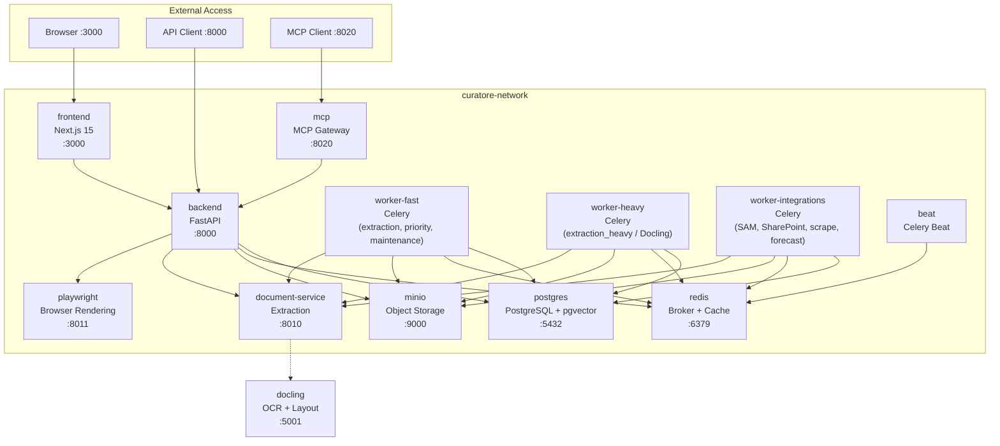
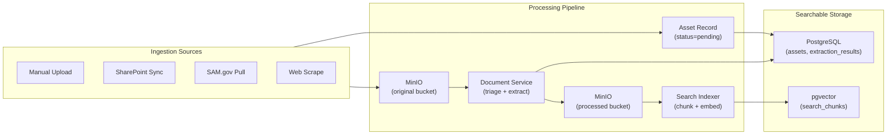
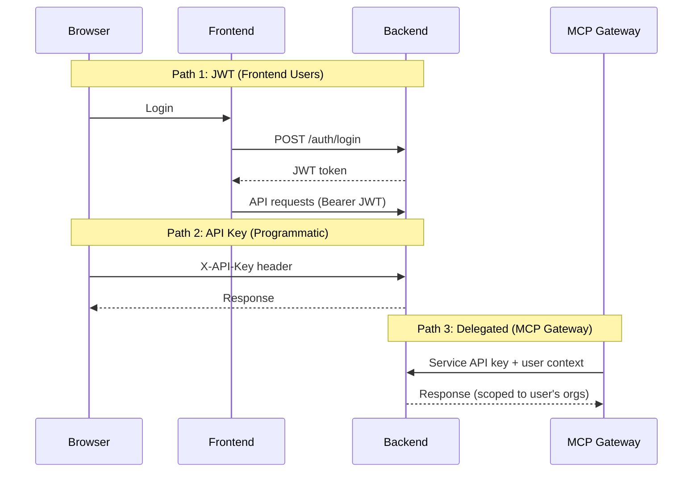
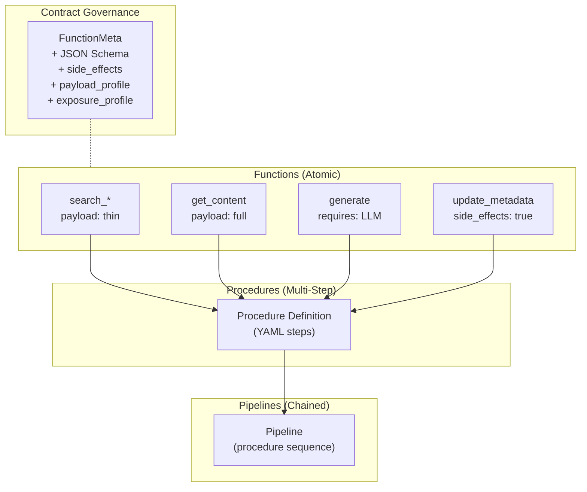

# Curatore Platform Architecture

Curatore is a document processing and workflow automation platform for government acquisition teams. It ingests documents from multiple sources, extracts and indexes content, and provides LLM-powered search and analysis workflows.

## Services

### Service Responsibilities

| Service | Owns | Delegates To |
|---------|------|-------------|
| **backend** | API, auth, database schema, CWR runtime, search | document-service (extraction), playwright (rendering) |
| **worker-fast** | Fast extraction (PyMuPDF/MarkItDown), priority tasks, maintenance | document-service |
| **worker-heavy** | Complex extraction (Docling OCR/layout) | document-service → docling |
| **worker-integrations** | External API sync (SAM, SharePoint, Salesforce, scrape, forecast) | document-service, external APIs |
| **beat** | Cron scheduling (maintenance, reindex) | workers (via Redis) |
| **frontend** | UI, client-side routing | backend (API) |
| **mcp** | AI tool protocol, function exposure | backend (delegated auth + API) |
| **document-service** | Triage, extraction (fast_pdf, markitdown) | docling (complex OCR/layout) |
| **playwright** | Browser rendering, JS execution | — |

## Data Flow

## Authentication

### Auth Rules

- Admin users have `organization_id=NULL` — never use `current_user.organization_id` directly
- Non-admin users access orgs via `user_organization_memberships` (no primary org concept)
- System org (`__system__`) is for CWR procedure ownership only
- Use dependency functions: `get_effective_org_id`, `get_current_org_id`, `get_user_org_ids`, `require_admin`

## CWR (Workflow Runtime)

### CWR Execution Rules

1. **Functions** are atomic operations with governance metadata (`FunctionMeta`)
2. **Procedures** chain functions into multi-step workflows (YAML-defined)
3. **Pipelines** chain procedures for complex processing
4. **Contracts** are auto-derived from `FunctionMeta` — no manual contract files
5. The AI procedure generator uses governance fields to place functions correctly:
   - `payload_profile="thin"` search → insert `get_content` before LLM steps
   - `side_effects=True` functions placed late in workflows
   - `send_email`/`webhook` guarded with conditionals

## Related Documentation

- [Documentation Index](INDEX.md) — Master map of all docs across all repos
- [Configuration](CONFIGURATION.md) — .env vs config.yml philosophy
- [Document Processing](DOCUMENT_PROCESSING.md) — Upload → extraction → indexing
- [Extraction Engines](EXTRACTION_SERVICES.md) — Triage, engine comparison
- [Data Connections](DATA_CONNECTIONS.md) — Adding new integrations
