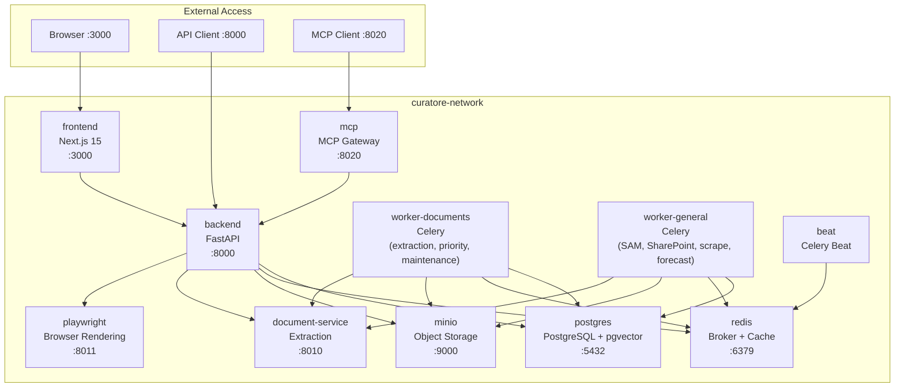
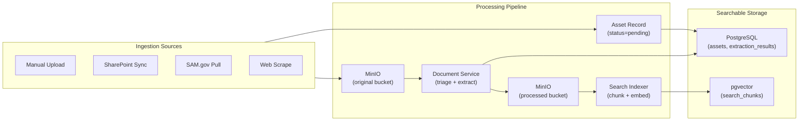
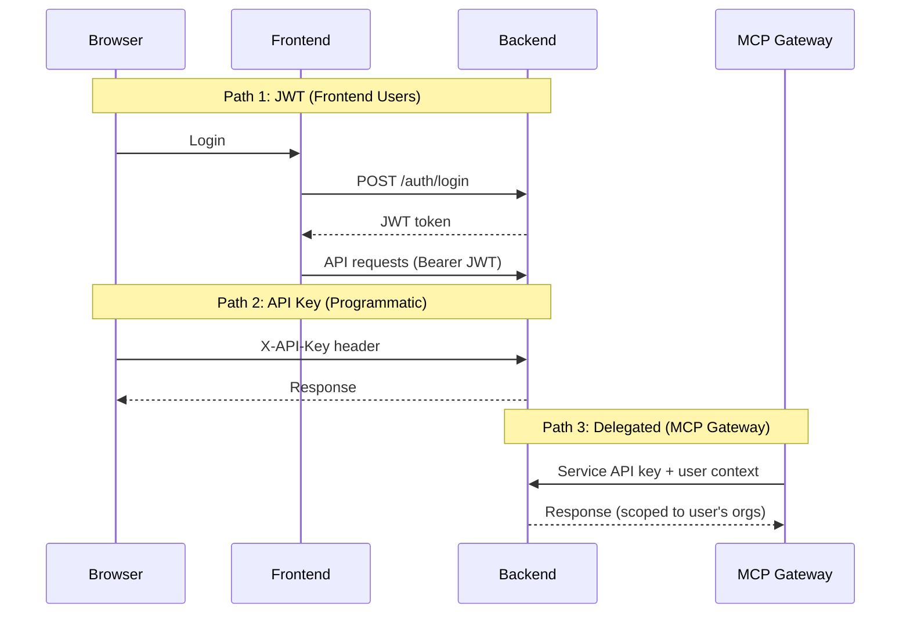
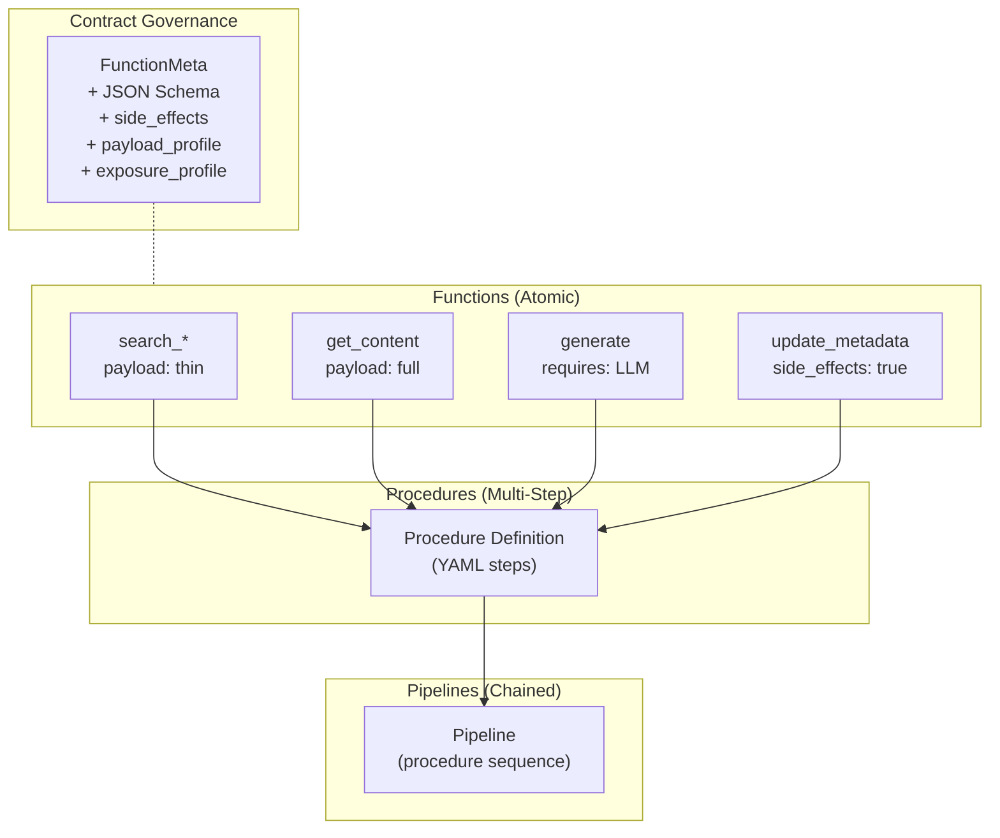

# Curatore Platform Architecture

Curatore is a document processing and workflow automation platform for government acquisition teams. It ingests documents from multiple sources, extracts and indexes content, and provides LLM-powered search and analysis workflows.

## Services



### Service Responsibilities

| Service | Owns | Delegates To |
|---------|------|-------------|
| **backend** | API, auth, database schema, CWR runtime, search | document-service (extraction), playwright (rendering) |
| **worker-documents** | Extraction (PyMuPDF/pymupdf4llm/MarkItDown), priority tasks, maintenance | document-service |
| **worker-general** | External API sync (SAM, SharePoint, Salesforce, scrape, forecast) | document-service, external APIs |
| **beat** | Cron scheduling (maintenance, reindex) | workers (via Redis) |
| **frontend** | UI, client-side routing | backend (API) |
| **mcp** | AI tool protocol, function exposure | backend (delegated auth + API) |
| **document-service** | Triage, extraction (fast_pdf, pymupdf4llm, markitdown) | — |
| **playwright** | Browser rendering, JS execution | — |

## Data Flow



### Search Pipeline

After indexing, the search pipeline processes queries in stages:

1. **Hybrid retrieval** — Parallel keyword (tsvector) + semantic (pgvector cosine) scoring
2. **Score fusion** — Weighted combination: `(1-w) × keyword + w × semantic`
3. **Cross-encoder reranking** (optional) — LLM/Cohere/Jina rescoring for improved relevance
4. **Relevance filtering** — Drop results below `min_relevance_score` threshold

See [Search Reranking](https://github.com/Amivero-LLC/curatore-backend/blob/main/docs/SEARCH_RERANKING.md) for configuration.

## Authentication



### Auth Rules

- Admin users have `organization_id=NULL` — never use `current_user.organization_id` directly
- Non-admin users access orgs via `user_organization_memberships` (no primary org concept)
- System org (`__system__`) is for CWR procedure ownership only
- Use dependency functions: `get_effective_org_id`, `get_current_org_id`, `get_user_org_ids`, `require_admin`

## CWR (Workflow Runtime)



### CWR Execution Rules

1. **Functions** are atomic operations with governance metadata (`FunctionMeta`)
2. **Procedures** chain functions into multi-step workflows (YAML-defined)
3. **Pipelines** chain procedures for complex processing
4. **Contracts** are auto-derived from `FunctionMeta` — no manual contract files
5. **Tool descriptions** contain routing intelligence — each tool's description explains when to use it, which search mode to pick, and what to do next. The MCP server also sends instructions with a tool-selection guide.
6. **Search modes**: `query="your terms"` for relevance-ranked text search; `query="*"` + `where`/`order_by` for structured listing and filtering
7. **Pagination**: `get_content` returns up to 10,000 characters; use `offset`/`limit` to paginate larger documents (`has_more` flag indicates more pages)
8. The AI procedure generator uses governance fields to place functions correctly:
   - `payload_profile="thin"` search → insert `get_content` before LLM steps
   - `side_effects=True` functions placed late in workflows
   - `send_email`/`webhook` guarded with conditionals

## Health Monitoring

Curatore uses a **push-based heartbeat** model for health monitoring. Every service writes its own health status to Redis DB 2 with a timestamp. No service polls another for health — the aggregator simply reads keys and uses timestamp math to determine freshness.

Three monitoring patterns handle three categories of service:

### Pattern 1: Core Infrastructure (Backend-Written)

The backend API process writes heartbeats for services it owns direct connections to: itself, database, redis, and object storage. An asyncio background task probes each every 30s and writes the result.

Workers and beat run in separate containers from the same Docker image. Each writes its own heartbeat via a daemon thread (30s interval).

**Services:** `backend`, `database`, `redis`, `storage`, `worker-documents`, `worker-general`, `beat`

### Pattern 2: Extracted Services (Self-Registering)

Each extracted microservice (document-service, playwright-service, mcp-service) runs its own `heartbeat_writer.py` asyncio task. The task writes directly to Redis DB 2 every 30s. The backend does **not** poll these services for health — if the backend is down, extracted services still report as healthy.

**Services:** `extraction_service`, `playwright`, `mcp_gateway`
**Writer:** `app/services/heartbeat_writer.py` in each service repo

### Pattern 3: External APIs (Event-Driven)

3rd-party APIs (LLM providers, SharePoint/Microsoft Graph) use `ExternalServiceMonitor` — an event-driven pattern that avoids wasteful periodic polling:

1. **Startup** — run initial health check, write result to heartbeat key
2. **While healthy** — no polling; consumers report errors as they encounter them
3. **On consumer error** — mark unhealthy in Redis, start recovery polling (every 30s)
4. **On recovery success** — mark healthy, stop polling

Consumers call `report_error()` / `report_success()` after each API interaction. Recovery polling kicks in only when the error threshold is reached.

**Services:** `llm`, `sharepoint`
**Monitor:** `app/core/shared/external_service_monitor.py`

### Architecture

```
Pattern 1: Core Infrastructure             Pattern 1: Workers
Backend API (asyncio, 30s)                  Daemon threads (30s each)
  |-- backend                                |-- worker-documents
  |-- database                               |-- worker-general
  |-- redis                                  |-- beat
  |-- storage
  v                                          v

Pattern 2: Extracted Services (self-register, 30s each)
  |-- document-service -> extraction_service
  |-- playwright-service -> playwright
  |-- mcp-service -> mcp_gateway
  v

Pattern 3: External APIs (event-driven)
  |-- LLM provider -> llm
  |-- Microsoft Graph -> sharepoint
  v

  Redis DB 2: curatore:heartbeat:*
            |
  Beat task (60s): SCAN + MGET all heartbeats
            |
  Aggregate -> curatore:system:status (120s TTL)
            |
  Pub/sub on status change -> WebSocket -> frontend StatusBar
```

### Redis Key Pattern

Keys: `curatore:heartbeat:{service_name}` (no TTL — timestamps are source of truth)

```json
{
  "status": "healthy",
  "last_heartbeat": "2026-02-17T15:42:03.000000Z",
  "metadata": { "version": "2.0.0" }
}
```

### Freshness Thresholds

| Service | Threshold | Pattern | Update Interval |
|---------|-----------|---------|-----------------|
| backend, database, redis, storage | 90s | Core infrastructure | 30s |
| worker-documents, worker-general, beat | 90s | Core infrastructure | 30s |
| extraction_service, playwright, mcp_gateway | 90s | Self-registering | 30s |
| llm, sharepoint | 600s | Event-driven | On demand + 30s recovery |

### Frontend Consumption

The frontend is display-only — it shows whatever the backend aggregator reports:

- **StatusBar** (bottom bar): receives real-time updates via WebSocket pub/sub
- **InfrastructureHealthPanel** (admin page): reads cached heartbeat data via `/health/comprehensive` (< 10 ms)
- **Refresh button**: triggers live HTTP checks via `/health/comprehensive?live=true` (5-20s, bypasses heartbeats)
- **Core vs all toggle**: core components (backend, database, redis, workers) always visible; extracted services, LLM, SharePoint shown via "Show All"

## Related Documentation

- [Documentation Index](INDEX.md) — Master map of all docs across all repos
- [Configuration](CONFIGURATION.md) — .env vs config.yml philosophy
- [Document Processing](DOCUMENT_PROCESSING.md) — Upload → extraction → indexing
- [Extraction Engines](EXTRACTION_SERVICES.md) — Triage, engine comparison
- [Data Connections](DATA_CONNECTIONS.md) — Adding new integrations
